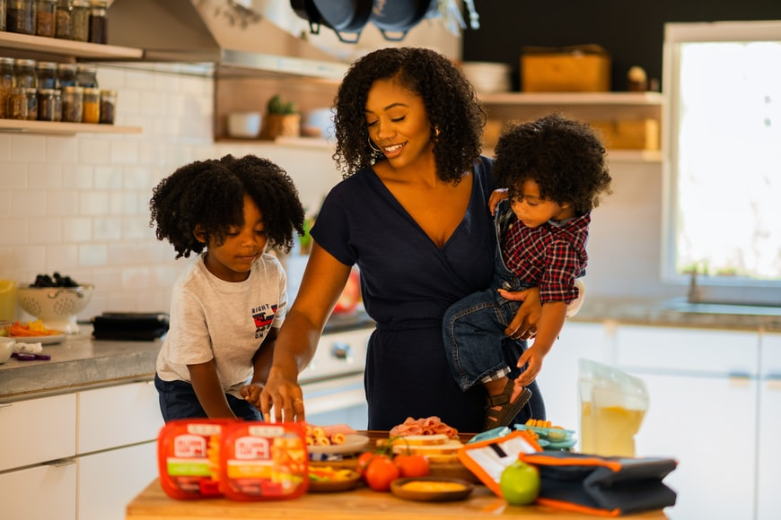

# Persian-Image-Captioning

[](https://huggingface.co/spaces/MahsaShahidi/Persian-Image-Captioning)

We fine-tuning the [Vision Encoder Decoder Model](https://huggingface.co/docs/transformers/v4.16.2/en/model_doc/vision-encoder-decoder#transformers.VisionEncoderDecoderModel) for the task of image captioning on the [coco-flickr-farsi](https://www.kaggle.com/navidkanaani/coco-flickr-farsi) dataset. The implementation of our model is in PyTorch with transformers library by Hugging Face(🤗).

You can choose any pretrained vision model and any language model to use in the Vision Encoder Decoder model. Here we use [ViT](https://huggingface.co/google/vit-base-patch16-224-in21k) as the encoder, and [ParsBERT (v2.0)](https://huggingface.co/HooshvareLab/bert-fa-base-uncased-clf-persiannews) as the decoder. The encoder and decoder are loaded separately via `from_pretrained()`function. Cross-attention layers are randomly initialized and added to the decoder.

You may refer to the [Vision Encoder Decoder Model](https://huggingface.co/docs/transformers/model_doc/vision-encoder-decoder) for more information.

## How to use
You can generate caption of an image using this model using the code below:
```python
import torch
import urllib
import PIL
import matplotlib.pyplot as plt
from transformers import ViTFeatureExtractor, AutoTokenizer, \
                         VisionEncoderDecoderModel

def show_img(image):
    # show image
    plt.axis("off")
    plt.imshow(image)
    
if torch.cuda.is_available():
    device = 'cuda'
else:
    device = 'cpu'


#pass the url of any image to generate a caption for it    
urllib.request.urlretrieve("https://images.unsplash.com/photo-1628191011227-522c7c3f0af9?ixlib=rb-1.2.1&ixid=MnwxMjA3fDB8MHxwaG90by1wYWdlfHx8fGVufDB8fHx8&auto=format&fit=crop&w=870&q=80", "sample.png")
image = PIL.Image.open("sample.png")


#Load the model you trained for inference 
model_checkpoint = './Persian-Image-Captioning/checkpoint-28000'
model = VisionEncoderDecoderModel.from_pretrained(model_checkpoint).to(device)

feature_extractor = ViTFeatureExtractor.from_pretrained('google/vit-base-patch16-224-in21k')
tokenizer = AutoTokenizer.from_pretrained('HooshvareLab/bert-fa-base-uncased-clf-persiannews')

sample = feature_extractor(image, return_tensors="pt").pixel_values.to(device)
caption_ids = model.generate(sample, max_length = 30)[0]
caption_text = tokenizer.decode(caption_ids, skip_special_tokens=True)
print(caption_text)
show_img(image)
```

## Inference
Following are the reslts of 3 captions generated on free stock photos after 2 epochs of training.
Image | Caption 
--- | --- 
 | **Generated Caption:** زنی در آشپزخانه در حال اماده کردن غذا است.
 | **Generated Caption:** گروهی از مردم در حال پرواز بادبادک در یک زمین چمنزار.
  | **Generated Caption:** مردی در ماشین نشسته و به ماشین نگاه می کند.


## Credits
A huge thanks to Kaggle for providing free access to GPU, and to the creators of Huggingface, ViT, and ParsBERT!


## References
[An Image is Worth 16x16 Words: Transformers for Image Recognition at Scale](https://arxiv.org/abs/2010.11929 )
